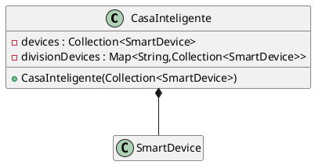

# Teste 20-21

Proposta de Resolucao (Nao está corrijida).

Avaliação: Teste de Programacao Orientada aos Objectos (A) MiEI e LCC - DI/UMinho 21/05/2021

by [Alef Keuffer](https://github.com/Alef-Keuffer)

## 1 

Sabendo que o metodo mediaGolos(String numJogador) da classe Equipa (que calcula a media
de golos do jogador indicado) nao devera produzir um valor para a media caso o numero de
jogador indicado nao exista, indique qual das seguintes implementacoes do metodo considera
correcta:

### 1 __Resposta__

c) (antepenultima)

```java
public double mediaGolos(String num) throws JogadorNaoExisteException {
    Jogador jog = this.jogadores.get(num);
    if (jog == null) {
        throw new JogadorNaoExisteException(num);
    }
    return jog.mediaGolos();
}
```

### 1 a)

```java
public double mediaGolos(String num) {
    double m = 0;
    Jogador jog = this.jogadores.get(num);
    if (jog != null) {
        m = jog.mediaGolos();
    }
    return m;
}
```

Se jogador nao existe produz media 0. Queremos que nao produza media.

### 1 b)

```java
public double mediaGolos(String num) throws JogadorNaoExisteException {
    return this.jogadores.get(num).mediaGolos();
}
```

Se jogador nao existe vamos ter `NullPointerException` porque `get` irá retornar `null` e nao temos `JogadorNaoExisteException`.

### 1 d)

```java
public double mediaGolos(String num) {
    Jogador jog = this.jogadores.get(num);
    if (jog == null) {
        throw new JogadorNaoExisteException(num);
    }
    return jog.mediaGolos();
}
```

Nao declara throw da exception na assinatura (só funcionaria se `JogadorNaoExisteException extends RuntimeException`).

### 1e)

```
Nenhuma das implementacoes e valida pois o metodo mediaGolos() na classe Jogador
nao e abstracto
```

Nao faz sentido, classes abstratas podem implementar metodos.

## 2

### 2 __Resposta__

(a) e (d) (penultima) sao consistentes. (a) trabalha diretamente com referencias nos getters e setters e (d) faz clones nos getters e setters.

```java
public void setConvocados(List<Jogador> conv) {
    this.convocados = conv;
}
public List<Jogador> getConvocados() {
    return this.convocados;
}
```

```java
public void setConvocados(List<Jogador> conv) {
    this.convocados = conv.stream()
                          .map(Jogador::clone)
                          .collect(Collectors.toList());
}
public List<Jogador> getConvocados() {
    List<Jogador> conv = new ArrayList();
    for(Jogador j: this.convocados) {
        conv.add(j.clone());
    }
    return conv;
}
```

## 3

### 3 __Resposta__

ultima ( d) ) ("A seguinte expressao e valida: `I i = new B();`")

`B` implementa `I` também tem esse tipo.

### 3 a)

> A definicao da interface `I` esta errada pois os seus metodos tˆem que ser abstractos."

Falso, todos os metodos de uma interface que nao sejam `default` sao implicitamente abstractos e nao precisamos marca-los como tal.

### 3 b)

> A classe `A` nao esta correcta pois nao pode definir o metodo `miA()` da interface `I`.

Pelo contrario, class `A` deve implementar os métodos da interface que implementa. Inclusive, não podemos ter certeza se `A` está correta porque não sabemos se implementa `miB()` da interface.

### 3 c)

> A classe `B` nao esta correcta pois nao define a implementacao do metodo `miA()`

Falso porque `B` extende `A` e `A` implementa `miA()`. Logo, `B` herda esse método.

## 4

### 4 __Resposta__

Acho que c) (penultima) está correta.

```java
public Set<Veiculo> veiculosDaMarca(String marca){
TreeSet<Veiculo> r = new TreeSet<>(
        (v1, v2) -> v1.getMatricula().compareTo(v2.getMatricula()));
    for (Veiculo v : this.viaturas.values()) {
        if (v.getMarca().equals(marca)) r.add(v.clone());
    }
    return r;
}
```

### 4 a)

```java
public Iterator<Veiculo> veiculosDaMarca(String marca) {
Iterator<Veiculo> r = this.viaturas.values().iterator();
    while(r.hasNext()) {
        Veiculo v = r.next();
        if (!v.getMarca().equals(marca)) r.remove();
    }
    r.sort((v1, v2) -> v1.getMatricula().compareTo(v2.getMatricula()));
    return r;
}
```

`Iterator` nao tem metodo `sort()`

### 4 b)

```java
public List<Veiculo> veiculosDaMarca(String marca){
Comparator<Veiculo> comp =
    (v1, v2) -> v1.getMatricula().compareTo(v2.getMatricula());
    return this.viaturas.stream()
                        .map(Veiculo::clone)
                        .filter(v -> !v.getMarca().equals(marca))
                        .sorted(comp)
                        .collect(Collectors.toList());
}
```

`viaturas` é do tipo `Map<String, Veiculo>` e instancias de `Map` nao tem metodo `stream()`.

### 4 d)

```java
public Set<Veiculo> veiculosDaMarca(String marca){
    List<Veiculo> r = new List<>();
    for (Map.Entry<String, Veiculo> e : this.viaturas.entrySet()) {
        Veiculo v = e.getValue();
        if (v.getMarca().equals(marca)) r.add(v.clone());
        r.sort((v1, v2) -> v1.getMatricula().compareTo(v2.getMatricula()));
    }
    return r;
}
```

Retornamos uma `List<Veiculo>` mas na assinatura dizemos que retornamos `Set<Veiculo>` e `List` não extende `Set`.

## 5

### 5 __Resposta__

d) (ultima)

```java
public Video getVideo(String user, String codVideo)
throws UserInexistenteException,VideoInexistenteException {
    if (!this.videos.containsKey(user))
        throw new UserInexistenteException("User "+user+" Inexistente");
    if (!this.videos.get(user).containsKey(codVideo))
        throw new VideoInexistenteException("Video "+codVideo+" Inexistente");
    return this.videos.get(user).get(codVideo).clone();
}
```

### 5 a)

```java
public Video getVideo(String user, String codVideo) {
    return this.videos.get(user).get(codVideo).clone();
}
```

Obtemos `NullPointerException` se não tivermos o usuário ou o vídeo. Isso não é bom tratamento de erros.

### 5 b)

```java
public Video getVideo(String user, String codVideo) {
    if (!this.videos.containsKey(user))
        throw new Exception("User " + user + " Inexistente");
    if (!this.videos.get(user).containsKey(codVideo))
        throw new Exception("Video " + codVideo + " Inexistente");
    return this.videos.get(user).get(codVideo).clone();
}
```

Não declara na assinatura que faz throw de `Exception` e mesmo assim `Exception` é a um `Throw` demasiadamente genérico.

### 5 c)

```java
public Video getVideo(String user, String codVideo) {
    Video v;
    try {
        v = this.videos.get(user).get(codVideo).clone();
    } catch (Exception e) {
        v = null;
    }
    return v;
}
```

Terrível, não avisa caso user ou video nao existam preferindo retornar `null`. O pior é fazer catch de `Exception` quando a intenção é capturar `NullPointerException` significa que não iremos detectar outros tipos de problemas.

## 6

```java
class CasaInteligente {

    private Collection<SmartDevice> devices;
    private Map<String,Collection<SmartDevice>> divisionDevices;

    public CasaInteligente(Collection<SmartDevice> devices) {
        // One consequence of this constructor is that there will be devices that are not in any division of the house.
        this.devices = devices.stream().map(SmartDevice::clone).toList();
    }
}
```

## 7




```java
public Collection<SmartDevice> getDevicesInComodo(String nomeDoComodo) {
    return this.divisionDevices.get(nomeDoComodo).stream(SmartDevice::clone).toList();
}
````

## 8

```java
class CasaInteligente {
    //...
    private static class DeviceNotFound extends Exception {}
    public void remove(String id) throws DeviceNotFound {
        SmartDevice d = this.devices.stream().filter(s -> s.id().toString().equals(id)).findAny().orElseThrow(DeviceNotFound::new);
        this.devices.remove(d);
        this.divisionDevices.values().forEach(c -> c.remove(d));
    }
}

```

Other solution

```java
public void remove(String id) throws DeviceNotFound {
        SmartDevice d = null;
        for (SmartDevice o: this.devices)
            if (o.getId().equals(id))
                {d = o;break;}
        if (d == null) throw new DeviceNotFound();
        this.devices.remove(d);
        for (Collection<SmartDevice> c: this.divisionDevices.values())
            c.remove(d);
    }
```

## 9

```java
public Iterator<SmartDevice> devicesPorConsumoCrescente() {
    return this.devices.stream().map(SmartDevice::clone).sorted(Comparator.comparingDouble(SmartDevice::totalConsumo)).iterator();
}

//Comparator.comparingDouble(SmartDevice::totalConsumo) ≡ (d1,d2) -> Double.compare(d1.totalConsumo(),d2.totalConsumo())
```

## 10

```java
    public String divisaoMaisEconomica() {

        TreeSet<String> a = new TreeSet<>((k1, k2) -> {
            
            double d1c = this.divisionDevices.get(k1).stream().reduce(0,Double::sum), d2c = this.divisionDevices.get(k1).stream().reduce(0,Double::sum);
            if (d1c == d2c) return d1.getId().compareTo(d2.getId());
            return Double.compare(k2, d1c);
        });

        a.addAll(this.devices);
        return a.last().clone();
    }
```


```java
    public String divisaoMaisEconomica() {
        return this.divisionDevices.entrySet().stream().min(
                (e1,e2) -> {
                    String k1 = e1.getKey(), k2 = e2.getKey();
                    double c1 = this.divisionDevices.get(k1).stream().map(SmartDevice::totalConsumo).reduce(0.0,Double::sum),
                           c2 = this.divisionDevices.get(k2).stream().map(SmartDevice::totalConsumo).reduce(0.0,Double::sum);
                    if (c1 == c2) return k1.compareTo(k2);
                    return Double.compare(c2, c1);
            }
        ).get().getKey();
    }
```

```java
class CasaInteligente {

    private Collection<SmartDevice> devices;
    private Map<String,Division> divisionDevices;

    private static class Division {
        String id;
        Collection<SmartDevice> devices;

        double totalConsumo() {return devices.stream().map(SmartDevice::totalConsumo).reduce(0.0,Double::sum);}
    }

    public String divisaoMaisEconomica() {
        return this.divisionDevices.stream().min(
            ((k1,v1),(k2,v2)) -> {
                double c1 = this.divisionDevices.get(k1).totalConsumo()
                       c2 = this.divisionDevices.get(k2).totalConsumo();
                if (v2.totalConsumo() == d2c.totalConsumo()) return k1.compareTo(k2);
                return Double.compare(d2c, d1c);
            }
            ).clone();
    }

}
```

## 11

```java
class SmartBulbDimmable extends SmartDevice {
    private double lightIntensity = .5;
    private double totalConsumo = 0;

    public SmartDevice (String id, double consumoPorHora) {
        super(id,consumoPorHora);
    }

    public consumoPorHora() {return consumoPorHora * lightIntensity;}

    @Override
    public totalConsumo() {return totalConsumo;}

    @Override
    public void turnOff() {
        this.on = false;
        long timeOn = Duration.between(this.inicio,LocalDateTime.now()).toHours();
        this.inicio == null;
        this.totalConsumo += timeOn * consumoPorHora();
    }


    private static class InvalidLightIntensity extends Exception {};
    public void changeLightIntensity (double newLightIntesity) {
        if (!(newLightIntesity >= 0 && newLightIntesity <= 1)) throw new InvalidLightIntensity();
        long timeOn = Duration.between(this.inicio,LocalDateTime.now()).toHours();
        inicio == LocalDateTime.now();
        totalConsumo += timeOn * consumoPorHora();
        lightIntensity = newLightIntesity;
    }
}
```

## 12

```java
public void alteraInfo(Consumer<SmartBulbDimmable> bd) {
    this.devices()
            .filter(v -> v instanceof SmartBulbDimmable)
            .map(v -> (SmartBulbDimmable)v)
            .forEach(bd);
}
```


```java
bd = s -> s.changeLightIntensity(.25);
```

## 13

```java
public boolean apenasNumaDivisao() {
    return this.devices.stream().distinct().count() == this.divisionDevices.values().stream().map(Collection::size).reduce(0,Integer::sum);
}
```

## 14

```java
public boolean gravaEmFichObjectos(String f) throws FileNotFoundException, IOException {
    ObjectOutputStream os = new ObjectOutputStream(new FileOutputStream(f));
    this.devices.stream().filter(sd -> sd instanceof SmartSpeaker).forEach(o -> os.writeObject(o));
    os.flush();
    os.close();
    return true;
}
```
